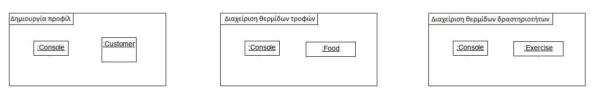
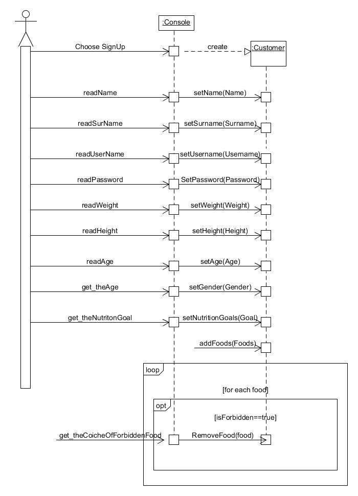
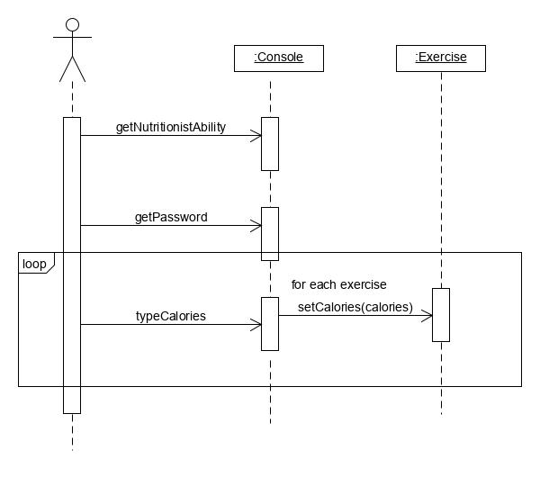

# Εισαγωγή 💭

Το έγγραφο αυτό περιέχει τις απαιτήσεις του παρόντος συστήματος καθώς και μια αναλυτική παρουσίαση των δυνατοτήτων του. Επίσης περιέχει  επεξήγηση των περιπτώσεων χρήσης του καθώς και υποθέσεις και εξαρτήσεις, απαραίτητες για την υλοποίηση του. Επιπρόσθετα περιλαμβάνεται μια σύνοψη των ειδικών απαιτήσεων του συστήματος, συμπληρωματικές προδιαγραφές όπως οι μη λειτουργικές απαιτήσεις καθώς και περιορισμούς σχεδίασης και υλοποίησης. Στην παράγραφο "Επισκόπηση" περιλαμβάνεται οδηγός των περιεχόμενων του εγγράφου.

## Εμβέλεια

Το σύστημα διατροφικού βοηθού θα παρέχει λειτουργικότητα για: 

* [X] Την καταγραφή των προσωπικών στοιχείων του χρήστη.
* [X] Την καταγραφή των σωματικών στοιχείων του χρήστη.
* [X] Τον υπολογισμό του βασικού μεταβολικού ρυθμού του χρήστη.
* [X] Τον υπολογισμό των ενεργειακών αναγκών του χρήστη.
* [X] Τον προσδιορισμό των απαραίτητων ποσοτήτων θρεπτικών συστατικών.
* [X] Τον υπολογισμό των αναγκών σε υγρά
* [X] Την καταγραφή των στόχων του χρήστη.
* [X] Την καταγραφή ανεπιθύμητων τροφών από τον χρήστη.
* [X] Την δημιουργία βάσης δεδομένων των τροφών.
* [X] Την παρουσίαση προτεινόμενων τροφών.
* [X] Την παρουσίαση προτεινόμενων δραστηριοτήτων.
* [X] Την καταγραφή της εβδομαδιαίας προόδου του χρήστη.

Το σύστημα διατροφικού βοηθού δεν θα παρέχει λειτουργικότητα για: 

* [ ] Την αμεσή επικοινωνία με διατροφολόγο.
* [ ] Την ειδοποίηση του χρήστη για την λήψη των απαραίτητων γευμάτων μέσω χρονοδιαγράμματος εργασιών.
* [ ] Την παρακολούθηση και καθοδήγηση των δραστηριοτήτων του χρήστη.
* [ ] Την διατροφική υποστήριξη σε περίπτωση ασθένιας
* [ ] Την καθοδήγηση για λήψη βιταμινών και ιχνοστοιχείων

## Αναφορές

* [ ] [Έγγραφο αναφοράς διατροφολογίας](Nutrition-Data/Nutrition.pdf)
* [ ] [Σημείο αναφοράς υπολογισμού θερμιδικής άξιας τροφών](https://www.everydayhealth.com/g00/calorie-counter/?i10c.ua=1&i10c.encReferrer=&i10c.dv=11)

## Επισκόπηση

* [ ] [Εισαγωγή](#Εισαγωγή-💭)
   * [ ] [Εμβέλεια](#Εμβέλεια)
   * [ ] [Αναφορές](#Αναφορές)
   * [ ] [Επισκόπηση](#Επισκόπηση)
* [ ] [Συνολική περιγραφή](#Συνολική-περιγραφή)
   * [ ] [Επισκόπηση μοντέλου περιπτώσεων χρήσης](#Επισκόπηση-μοντέλου-περιπτώσεων-χρήσης-⚽)
* [ ] [Ειδικές Απαιτήσεις](#Ειδικές-Απαιτήσεις)
   * [ ] [Περιπτώσεις χρήσης](#Περιπτώσεις-χρήσης)
      * [ ] [Οι ενδιαφερόμενοι και οι ανάγκες τους](#Οι-ενδιαφερόμενοι-και-οι-ανάγκες-τους)
      * [ ] [Actors του συστήματος](#Actors-του-συστήματος)
      * [ ] [Περιγραφές περιπτώσεων χρήσης](#Περιγραφές-περιπτώσεων-χρήσης)
   * [ ] [Συμπληρωματικές προδιαγραφές](#Συμπληρωματικές-προδιαγραφές)
      * [ ] [Απαιτήσεις διεπαφών](#Απαιτήσεις-διεπαφών)
    * [ ]  [Περιορισμοί σχεδίασης και υλοποίησης](#Περιορισμοί-σχεδίασης-και-υλοποίησης)
    * [ ]  [Ποιοτικά χαρακτηριστικά](#Ποιοτικά-χαρακτηριστικά)
* [ ]  [Υποστηρικτικό υλικό](#Υποστηρικτικό-υλικό)
    * [ ]  [Μοντέλο πεδίου](#Μοντέλο-πεδίου)
    * [ ]  [Ανάλυση περιπτώσεων χρήσης](#Ανάλυση-περιπτώσεων-χρήσης)
        * [ ] [Κλάσεις ανάλυσης](#Κλάσεις-ανάλυσης)
        * [ ] [Συμπεριφορές](#Συμπεριφορές)
     * [ ] [Επιχειρησιακοί κανόνες](#Επιχειρησιακοί-κανόνες)

# Συνολική περιγραφή

## Επισκόπηση μοντέλου περιπτώσεων χρήσης ⚽

* [ ] Υποβολή διατροφικών και αθλητικών δεδομένων απο τον διατροφολόγο.
* [ ] Εισαγωγή χαρακτηρηστικών. Όπως:
    * [ ] Βάρος.
    * [ ] Ύψος
    * [ ] Ηλικία
    * [ ] Φύλο
* [ ] Δυνατότητα εισαγωγής διατροφικών στόχων. Όπως:
    * [ ] Διατήρηση βάρους.
    * [ ] Απώλεια βάρους 0.5kg/1kg ανά εβδομάδα.
    * [ ] Λήψη βάρους 0.5kg/1kg ανά εβδομάδα.    
* [ ] Δυνατότητα εισαγωγής τύπου δραστηριότητας. Όπως:
    * [ ] Ημερίσια.
    * [ ] Εβδομαδιαία.
    * [ ] Μηνιαία.
    * [ ] Και άλλα.
* [ ] Εμφάνιση προβλεπόμενων θερμιδών προς κατανάλωση με βάση τα χαρακτηρηστικά του πελάτη.
* [ ] Δυνατότητα εισαγωγής καταναλωμένων τροφων και πραγματοποιημένων δραστηριοτήτων από τον πελάτη.
* [ ] Δυνατότητα καταγραφής βάρους σε εβδομαδιαία βάση.
* [ ] Δυνατότητα εισαγωγής ανεπιθύμητων τροφών από τον πελάτη.
* [ ] Δυνατότητα εμφάνισης προτεινόμενων τροφών για τις ανάγκες του πελάτη.
* [ ] Δυνατότητα παρακολούθησης της προόδου του πελάτη σε σχέση με τους στόχους του.
* [ ] Δυνατότητα παραγωγής εβδομαδιαίων στατιστικών με απόκλιση από τους στόχους του.

###

# Ειδικές Απαιτήσεις

## Περιπτώσεις χρήσης

### Οι ενδιαφερόμενοι και οι ανάγκες τους

| Ενδιαφερόμενοι | Ανάγκες |
| :----------------------| :---------|
| Διατροφολόγος | Να μπορεί ανά πάσα στιγμή να τροποποιήσει τα χαρακτηριστικά των τροφών
| Χρήστης | Να του δίνονται διατροφικές προτάσεις κατ' απαίτηση   Να του δίνονται δραστηριακές προτάσεις κατ' απαίτηση   Να ελέγχει ανά πάσα στιγμή την πρόοδό του  Να αλλάξει τους στόχους του   Να καταγράφει τις τροφές που καταναλώνει και τις δραστηριότητες που πραγματοποιεί

### Actors του συστήματος

| Actors | Περιγραφή | Στόχοι | Ενδιαφερόμενοι |
| :----------------------| :---------| :---------| :---------|
| Διατροφολόγος | Είναι υπεύθυνος για την εισαγωγή των τροφών και τον θερμίδων τους στην βάση δεδομένων καθώς και για την εισαγωγή των κατάλληλων τύπον για τον εξαγωγή διατροφικών συμπερασμάτων.| Εισαγωγή διατροφολογικών δεδομένων | Διατροφολόγος |
| Χρήστης | Άτομα άνω των 10 ετών έχουν πρόσβαση σε διαθέσιμα προγράμματα για την εκπλήρωση των στόχων τους. | Αναζήτηση κατάλληλου διατροφικού προγράμματος | Χρήστης |

### Περιγραφές περιπτώσεων χρήσης

#### [ΠΧ1 Δημιουργία προφίλ χρήστη](uc1-profile-creation.md)

#### [ΠΧ2 Ταυτοποίηση χρήστη](uc2-user-identification.md)

#### [ΠΧ3 Διαχείριση τροφών](uc3-calories-food-administration.md)

#### [ΠΧ4 Διαχείριση δραστηριοτήτων](uc4-calories-exercise-administration.md)

#### [ΠΧ5 Ημερήσια Καταγραφή Διατροφής](uc5-daily-input-of-foods.md)

#### [ΠΧ6 Ημερήσια Καταγραφή Δραστηριοτήτων](uc6-daily-input-of-excersizes.md)

#### [ΠΧ7 Εβδομαδιαία Καταγραφή Βάρους](uc7-weekly-weight-input.md)

#### [ΠΧ8 Προτάσεις Διατροφής](uc8-suggesttion-of-food.md)

#### [ΠΧ9 Προτάσεις Δραστηριοτήτων](uc9-suggestion-of-sports.md)

#### [ΠΧ10 Εμφάνιση Προβλεπόμενων Θερμιδών](uc10-show-expected-values.md)

#### [ΠΧ11 Εμφάνιση Προόδου](uc11-show-progress.md)

## Συμπληρωματικές προδιαγραφές

### Απαιτήσεις διεπαφών

| Κατηγορία | Περιγραφή |
| :----------------------| :---------|
| Διεπαφές χρήστη | Όλες οι διεπαφές χρήστη θα βρίσκονται σε περιβάλλον κινητού, ταμπλέτας ή συστήματος προσομοίωσης λογισμικού Android.   |

### Περιορισμοί σχεδίασης και υλοποίησης

| Κατηγορία | Περιγραφή |
| :----------------------| :---------|
| Android | Το σύστημα θα αναπτυχθεί στο περιβάλλον του Android Studio   Το σύστημα θα μπορεί να εκτελείται σε ηλεκτρονικές συσκευές με λογισμικό Android 5.1 (Lollipop) ή νεότερη.|
| Java | Ο πηγαίος κώδικας του συστήματος θα γραφτεί σε Java 8.0 .|
| XML | Αρκετοί πόροι του συστήματος θα περιγράφονται σε XML αρχεία. |

### Ποιοτικά χαρακτηριστικά

| Table | Περιγραφή |
| :----------------------| :---------|
| Απόδοση | Το σύστημα θα πρέπει να ανταποκρίνεται στα αιτήματα του πελάτη σε χρόνο μικρότερο από 20 δευτερόλεπτα. |
| Διαθεσιμότητα | Το σύστημα είναι διαθέσιμο διαρκώς. |
| Ασφάλεια | Ο χρήστης θα εισέρχεται στο σύστημα με το μοναδικό συνδιασμό του username και password. |
| Ευελιξία | Σε περίπτωση ενημέρωσης των πινακών των τροφών απ' το διατροφολόγο, ο χρήστης επιλέγει πότε θα ενημερώσει το σύστημά του, κατόπιν κατάλληλης ειδοποίησης.   Ενδεχόμενη ενημέρωση των πινακών των τροφών απ' το διατροφολόγο, θα πρέπει να πραγματοποιείται σε διάστημα τουλάχιστον 10 ημερών μετά την τελευταία ενημέρωση. |
| Ευχρηστία | Ο χρήστης καλείται να γνωρίζει το βασικό χειρισμό λογισμικου Android 5.1 και άνω.   Δεν υπάρχει ανάγκη για εκπαίδευση του χρήστη, καθώς υπάρχουν ενδείξεις και υποδείξεις για καθοδήγηση σε κάθε στάδιο του συστήματος, τις οποίες μπορεί να απενεργοποιήσει όποτε ο ίδιος εξοικειωθεί με το σύστημα.|

# Υποστηρικτικό υλικό

## Μοντέλο πεδίου

## Ανάλυση περιπτώσεων χρήσης
--------------------------

### Κλάσεις ανάλυσης

### Συμπεριφορές

#### Διάγραμμα ακολουθίας - Δημιουργία Προφίλ

#### Διάγραμμα ακολουθίας - Διαχείριση θερμιδών τροφών

#### Διάγραμμα ακολουθίας - Διαχείρηση θερμίδων αθλητικών δραστηριοτήτων

## Επιχειρησιακοί κανόνες 

| Επιχειρησιακοί κανόνες | Περιγραφή |
| :----------------------| :---------|
| ΕΚ1 | Η ηλικία του χρήστη πρέπει να είναι μεγαλύτερη των 10 ετών.
| ΕΚ2 | Όλα τα στοιχεία του πελάτη είναι υποχρεωτικά.
| ΕΚ3 | Tα username των πελατών πρέπει να είναι μοναδικά.
| ΕΚ4 | Τα password των πελάτων θα πρέπει να αποτελείται από τούλαχιστον 1 αριθμό, 1 σύμβολο και 5 γράμματα.
| ΕΚ5 | Οι επιτρεπτές τίμες για την εισαγωγή των κιλών είναι πραγματικοί αρθμοί από 0 εώς 999.
| ΕΚ6 | Οι επιτρεπτές τιμές για την εισαγωγή του ύψους είναι πραγματικοί αριθμοί από 0 εώς 7. 
| ΕΚ7 | Οι επιτρεπτές τιμές για την εισαγωγή της ηλικίας είναι ακέραιοι αριθμοί από 10 εώς 150.