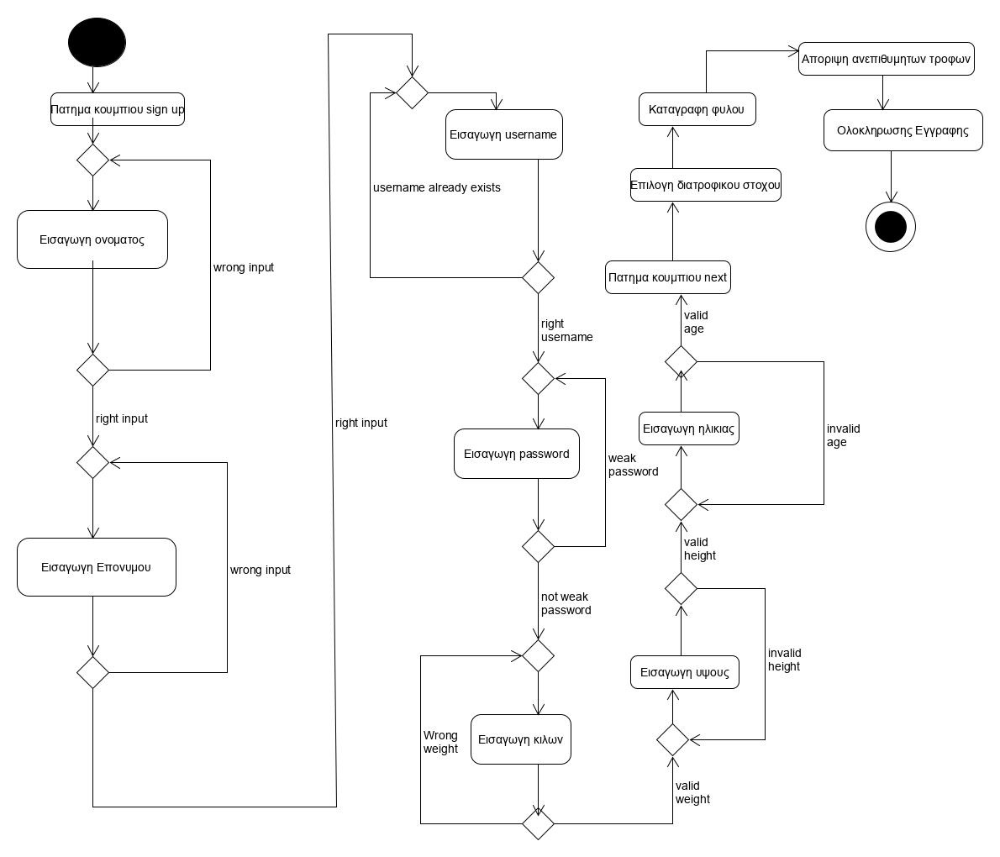

# ΠΧ1. Διαμορφωση προφιλ

Ο πελάτης μπαίνει στο σύστημα. Το σύστημα αρχικά του παρέχει 2 πεδία. Το Sign in και το Sing Up. Αν δεν έχει λογαριασμό επιλέγει το κουμπί Sign Up. Αφού το πατήσει εμφανίζεται μια φόρμα, όπου ο πελάτης συμπληρώνει: Όνομα, Επώνυμο, e-mail, Username, Password, κιλά, ηλικία, φύλο και ύψος. Κάτω απ' τη φόρμα υπάρχει το κουμπί next, το οποίο μεταφέρει το χρήστη παράκατω, με την προϋπόθεση ότι συμπλήρωσε όλα τα πεδία με αποδεκτά στοιχεία. To username του πελάτη δεν πρέπει να ταυτίζεται με κανένα άλλο ήδη υπάρχον Username. Σε περίπτωση διπλοτυπίας εμφανλιζεται το μήνυμα: "That username already exists." κάτω απ' το πεδίο του Username. Το username μπορεί να αποτελείται από οποιονδήποτε χαρακτήρα π.χ.(Α,^,&,3,κλπ). Το password θα πρέπει να αποτελείται από τούλαχιστον 1 αριθμό, 1 σύμβολο και 5 γράμματα. Αν κάποιοι περιορισμοί δεν ικανοποιούνται, τότε το σύστημα τους εμφανίζει κάτω απ' το πεδίο password, απορρίπτοντας το δοθέν password και ζητώντας απ' τον χρήστη να εισάγει καινούργιο. Έπειτα ο χρήστης συμπληρώνει τα κιλά του στο σύστημα. Οι επιτρεπτές τίμες είναι πραγματικοί αρθμοί από 0 εως 999. Οποιαδήποτε άλλη εισαγωγή απορρίπτεται απ' το σύστημα. Στη συνέχεια, ο χρήστης συμπληρώνει το ύψος του στο σύστημα. Οι επιτρεπτές τιμές είναι πραγματικοί αριθμοί από 0 εώς 7. Οποιαδήποτε άλλη εισαγωγή απορρίπτεται απ' το σύστημα. Ύστερα, ο χρήστης συμπληρώνει την ηλικία του στο συστημα. Οι επιτρεπτές τιμές είναι ακέραιοι αριθμοί από 0 εώς 150. Οποιαδήποτε άλλη εισαγωγή απορρίπτεται απ' το σύστημα.

#
Αφού συμπληρωθεί σωστά η φόρμα, ο χρήστης επιλέγει το κουμπί next. Στη συνέχεια συναντά ένα RadioBox με τις επιλογές "Άντρας" και "Γυναίκα" για να επιλέξει το φύλο. Ο χρήστης υποχρεωτικά επιλέγει μία απ' τις 2 για να προχωρήσει στο επόμενο βήμα.
Παρακάτω υπάρχει ένα ακόμα RadioBox με τους διατροφίκους του στόχους.

* [ ] Διατήρηση βάρους
* [ ] Απώλεια βάρους 0.5kg/1kg ανά εβδομάδα
* [ ] Αύξηση βάρους 0.5kg/1kg ανά εβδομάδα

#
Έπειτα υπάρχει ένα checkbox με σκοπό ο χρήστης να κάνει κλικ στις τροφες που δεν επιθυμεί να καταναλώσει. Μπορεί να επιλέξει όσες θέλει ή καμία.

#
Μετά υπάρχουν δύο κουμπια, το back αν επιθυμεί ο χρήστης να ελεγξεί τη φόρμα για τυχόν λάθη και το κουμπί register, ώστε ο χρήστης να ολοκληρώσει την εγγραφή.

#
Αφού ο χρηστης συμπληρώσει τα στοιχεια και πατησει το κουμπί register, η εγγραφή ολοκληρώνεται και διαμορφώνεται το προφίλ του. Έκτοτε, ο χρήστης μπορεί να χρησιμοποιήσει το σύστημα για να εξυπηρετήσει το σκοπό του.

#

## Βασική ροή

* [1]  Ο πελάτης πατάει το κουμπι Sign Up.
* [2]  O πελάτης καταγράφει Όνομα.
* [3]  O πελάτης καταγράφει Επώνυμο.
* [4]  O πελάτης καταγράφει e-mail.
* [5]  O πελάτης δημιουργεί Username.
* [6]  O πελάτης δημιουργεί Password.
* [7]  O πελάτης καταγράφει κιλά.
* [8]  O πελάτης καταγράφει ύψος.
* [9]  Ο πελάτης καταγράφει ηλικία.
* [10] Ο πελάτης πατάει το κουμπί next. 
* [11] Ο πελάτης επιλέγει το φύλο του.
* [12] Ο πελάτης επιλέγει τους διατροφικούς του στόχους.
* [13] Ο πελάτης επιλέγει τις τροφές που δεν επιθυμεί να καταναλώσει.
* [14] Ο πελάτης πατάει το κουμπί register.

## Εναλλακτικές ροές

* [2a] Ο πελατης καταχωρεί στο πεδίο Όνομα σύμβολα και αριθμούς.
  * [1] Η εφαρμογή του εμφανίζει μήνυμα λάθους κάτω απ' το πεδίο Όνομα και απορρίπτει το δοθέν input.
* [3a] Ο πελατης καταχωρεί στο πεδίο Επώνυμο σύμβολα και αριθμούς.
  * [1] Η εφαρμογή του εμφανίζει μήνυμα λάθους κάτω απ' το πεδίο Επώνυμο και απορρίπτει το δοθέν input.
* [4a] Ο πελατης δεν δίνει έγκυρο e-mail
    * [1] Η εφαρμογή τον ενημερώνει πως δεν είναι έγκυρο το e-mail κάτω απ' το πεδίο e-mail και απορρίπτει το δοθέν input.
* [5a] To Username του πελατη ταυτίζεται με άλλο Username
     *[1] Η εφαρμογη τον ενημερωνει με καταληλο μυνημα διπλα απ το παιδιο username και δεν δεχεται το συγκεκριμενο input
* [6a] Ο κωδικος του πελατη δεν πληρει ενα απ τα κριτηρια:Τουλαχιστον ενας αριθμος,τουλαχιστον ενα συμβολο και τουλαχιστον πεντε γραμματα
  * [1] Η εφαρμογη ενημερωνει τον πελατη με καταληλο μυνημα και δεν δεχεται το συγκεκριμενο input
* [7a] Ο πελατης δινει συμβολα η γραμματα ως input η αρνητικο βαρος
  * [1] Η εφαρμογη ενημερωνει τον πελατη πως θελει μονο θετικο αριθμο  και δεν δεχεται το συγκεκριμενο input 
* [8a] Ο πελατης δινει συμβολα η γραμματα ως input η δινει αριθμο που δεν ανηκει στο διαστημα[0,7]
  * [1] Η εφαρμογη ενημερωνει τον πελατη πως θελει αριθμο και δεν δεχεται το συγκεκριμενο input και ενημερωνει τον πελατη για το διαστημα των τιμων
* [9a] Ο πελατης δινει συμβολα η γραμματα ως input η δινει δεκαδικο αριθμο η αριθμο που να μην ανηκει στο διαστημα [0,99]
  * [1] Η εφαρμογη ενημερωνει τον πελατη με καταληλο μυνημα
* [10a] Ο πελατης παταει το κουμπι next χωρις να ειναι συμπληρωμενα η αποδεκτα ολα τα παιδια
  * [1] Η εφαρμογη ενημερωνει τον πελατη με καταληλο μυνημα
* [14] Ο πελατης παταει το κουμπι registration complete χωρις να εχει συμπληρωσι ολα τα παιδια.
  * [1] Η εφαρμογη ενημερωνει τον πελατη με καταληλο μυνημα
  
## Διαγράμματα
  
### Διάγραμμα δραστηριότητας - Άνοιγμα νέου λογαριασμού

