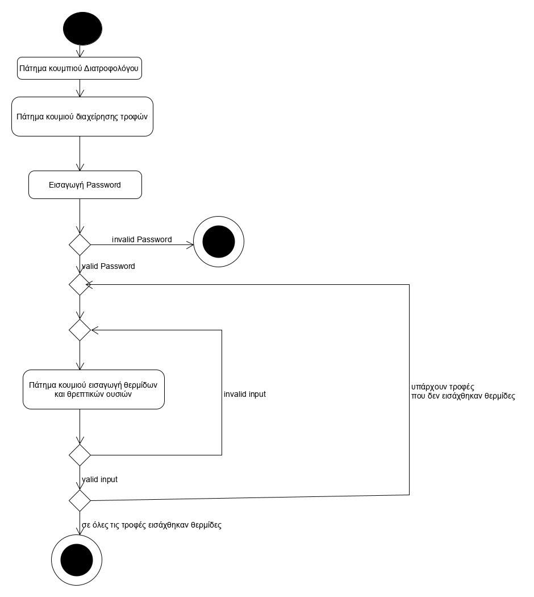

# ΠΧ3 Διαχείριση συστατικών τροφών
Αφού γίνει η εισαγωγή των τροφών απ' το διατροφολόγο, ο ίδιος συνδέεται στο σύστημα μέσω της ταυτοποίησης χρήστη, με σκοπό να διαχειριστεί τις τιμές των θερμιδών. Έπειτα, εισάγει για κάθε τροφή την περιεκτικότητα των θερμιδών τους, κάνοντας κλικ στο κουμπι "Διαχείριση τροφών" και μετά στο κουμπί "Εισαγωγή συστατικών". Σε περίπτωση που κάποια τροφή έχει ήδη συπληρωμένα συστατικά, το σύστημα δίνει την επιλογή "Τροποποίηση τροφών" στον διατροφολόγο.  Τέλος, πραγματοποιεί το προηγούμενο βήμα για κάθε τροφή.

# Σενάριο
* [1] Ο Διατροφολόγος συνδέεται στο σύστημα.
* [2] Ο Διατροφολόγος πατάει το κουμπί "Διαχείριση τροφών".
* [3] O Διατροφολόγος πατάει το κουμπί "Εισαγωγή συστατικών".
* [4] Εμφανίζονται όλες οι τροφές.
* [5] Για κάθε τροφή ο διατροφολόγος πατάει το κουμπί "Εισαγωγή συστατικών".
* [6] Για κάθε τροφή ο διατροφολόγος κατάγραφει τα συστατικά της.

# Εναλλακτική ροή
* [5a] O Διατροφολόγος έχει ήδη συμπληρώσει τα συστατικά κάποιας τροφής.
  * [1] To σύστημα του δίνει την επιλογή "Τροποποίηση συστατικών" προκειμένου να αλλάξει κάποια τιμή που έχει εισάγει στο παρελθόν.
* [6a] O Διατροφολόγος πληκτρολογεί άκυρο input αντί για θετικό αριθμό.
  * [1] To σύστημα ενημερώνει τον πελάτη για το σφάλμα της εισόδου του με κατάλληλο μήνυμα.
  
## Διαγράμματα
  
### Διάγραμμα δραστηριότητας - Διαχείριση συστατικών τροφών

