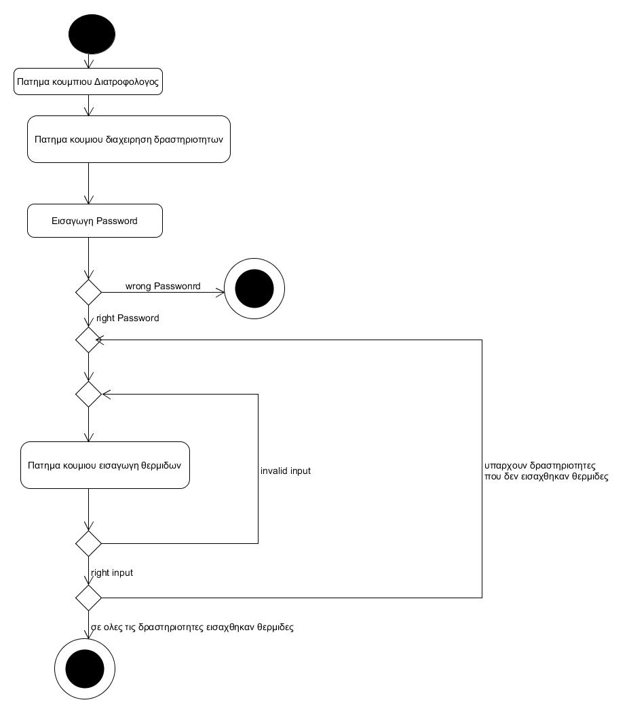

# ΠΧ4 Διαχείριση θερμίδων αθλητικών δραστηριοτήτων
Αφού γίνει η εισαγωγή δραστηριοτήτων απ' το διατροφολόγο, ο ίδιος συνδέεται στο σύστημα μέσω της ταυτοποίησης χρήστη, με σκοπό να διαχειριστεί τις θερμίδες αυτών. Έπειτα εισάγει για καθε αθλητική δραστηριότητα το ποσό των θερμίδων που καίει κάθε δραστηριότητα. Για να το επιτύχει αυτό επιλέγει το κουμπί "Δραστηριότητες" και μετά το κουμπί "Εισαγωγή θερμίδων". Τέλος, πραγματοποιεί την εισαγωγή των θερμίδων για κάθε δραστηριότητα.

# Σενάριο
* [1] Ο Διατροφολόγος συνδέεται στο σύστημα.
* [2] Ο Διατροφολόγος πατάει το κουμπί "Διαχείριση Δραστηριοτήτων".
* [3] O Διατροφολόγος πατάει το κουμπί "Εισαγωγή θερμίδων".
* [4] Εμφανίζονται όλες οι δραστηριότητες.
* [5] Για κάθε δραστηριότητα ο διατροφολόγος πατάει το κουμπί "Εισαγωγή θερμίδων".
* [6] Για κάθε δραστηριότητα ο διατροφολόγος κατάγραφει τις θερμίδες που καίει.

# Εναλλακτικές ροές
* [5a] O Διατροφολόγος έχει ήδη συμπληρώσει τις θερμίδες κάποιας δραστηριότητας.
  * [1] To σύστημα του δίνει την επιλογή "Τροποποίηση θερμιδών" προκειμένου να αλλάξει κάποια τιμή που έχει εισάγει στο παρελθόν.
* [6a] O Διατροφολόγος εισάγει χαρακτήρες, σύμβολα η αρνητικό αριθμό ως input.
  * [1] To σύστημα τον ενημερώνει με κατάλληλο μήνυμα και απορρίπτει το παρόν input.
  
## Διαγράμματα
  
### Διάγραμμα δραστηριότητας - Διαχείρηση θερμίδων αθλητικών δραστηριοτήτων

